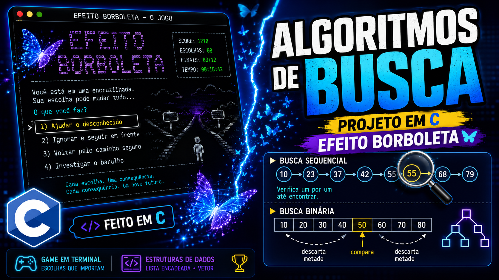

# Efeito Borboleta

Jogo de decisões em texto, feito em C. O jogador cria um nickname, vive uma
pequena história de 6 eventos e, a cada evento, escolhe entre ~3 alternativas
que alteram seu score. O score acumulado ao final define um entre três finais
possíveis.

## Vídeo de apresentação

[](https://youtu.be/1tVAzx8xpkc)

Clique na imagem acima para assistir à apresentação do projeto no YouTube.

## Objetivo

Este projeto existe para explorar, na prática, estruturas de dados e
algoritmos de busca em C dentro de um programa pequeno e fácil de explicar:
uma lista encadeada de decisões percorrida com **busca sequencial** e um
vetor de eventos ordenado percorrido com **busca binária**.

## Estrutura

```
include/
    domain.h    tipos do domínio: Jogador, Decisao, NoDecisao, Evento, Jogo
    player.h    cadastro e score do jogador
    decision.h  lista encadeada de decisões + busca sequencial
    story.h     eventos da história e cálculo do final
    search.h    busca binária e as versões de demonstração em vetor
    game.h      menu principal e o laço de execução da partida

src/
    main.c      ponto de entrada: apenas chama o menu principal
    player.c
    decision.c
    story.c
    search.c
    game.c

tests/
    test_search.c   testes com assert() para os algoritmos de busca
```

Cada evento guarda suas decisões em uma lista encadeada (`NoDecisao`); os
eventos, por sua vez, ficam em um vetor (`Evento eventos[TOTAL_EVENTOS]`)
sempre montado em ordem crescente de ID em `inicializar_historia`. Cada
`Decisao` carrega um `proximo_evento`, que é o ID do próximo evento no vetor
(ou `EVENTO_FIM`, quando a história termina).

## Algoritmos implementados

### Busca sequencial

Onde: `decision.c`, dentro da lista encadeada de decisões de um evento.

```c
NoDecisao *buscar_decisao(NoDecisao *inicio, int id);
NoDecisao *buscar_decisao_instrumentada(NoDecisao *inicio, int id, int *comparacoes);
```

A cada rodada, o jogo tem uma lista encadeada com as decisões do evento
atual. Como é uma lista (sem acesso por índice) e são poucas decisões, faz
sentido percorrê-la nó a nó comparando o ID até achar a escolhida — não há
como "pular direto" para o meio de uma lista encadeada. É exatamente isso
que `buscar_decisao` já fazia; `buscar_decisao_instrumentada` faz o mesmo
percurso e conta as comparações, usada no modo debug do jogo (opção 2 do
menu) e na tela de demonstração.

**Complexidade:** O(n), pois no pior caso é preciso visitar todos os nós.

### Busca binária

Onde: `search.c`, sobre o vetor de eventos e sobre os vetores de
demonstração.

```c
Evento *buscar_evento_binario(Evento eventos[], int tamanho, int id, int *comparacoes);
```

A cada evento, o jogo precisa localizar o `Evento` correspondente ao ID
retornado pela decisão anterior. Como os eventos ficam num vetor sempre
ordenado por ID, dá para dividir o espaço de busca ao meio a cada
comparação em vez de olhar evento por evento — daí a busca binária ser
usada aqui em vez da sequencial. A pré-condição é justamente essa: **o
vetor precisa estar ordenado**; se não estivesse, o algoritmo poderia
descartar a metade errada e nunca achar o elemento.

**Complexidade:** O(log n). Com apenas 6 eventos a diferença não é grande,
mas o objetivo é didático: mostrar como o número de comparações cresce bem
mais devagar que na busca sequencial à medida que o conjunto aumenta — é
por isso que a tela de demonstração (item abaixo) existe.

## Compilação

```bash
make
```

Gera o executável `efeito_borboleta` (ou `efeito_borboleta.exe` no
Windows). Compilado com `-Wall -Wextra -Wpedantic`, sem warnings.

```bash
make clean
```

Remove os artefatos de build.

## Execução

```bash
./efeito_borboleta
```

## Testes

```bash
make test
```

Compila e roda `tests/test_search.c`, que usa `assert()` para validar, tanto
na busca sequencial quanto na binária: primeiro elemento, elemento do meio,
último elemento, busca sem sucesso, vetor de um único elemento e vetor
vazio.

## Demonstração dos algoritmos

O menu principal tem três formas de ver as buscas em ação:

- **[1] Iniciar jogo** — fluxo normal, sem instrumentação visível.
- **[2] Iniciar jogo (modo debug)** — mostra, a cada evento, quantas
  comparações a busca binária fez para localizar o evento no vetor e
  quantas a busca sequencial fez para localizar a decisão escolhida na
  lista encadeada.
- **[3] Demonstração de algoritmos de busca** — roda os dois algoritmos
  lado a lado sobre o mesmo vetor de IDs de eventos: mostra o passo a passo
  da busca sequencial, o passo a passo da busca binária (início, fim, meio
  e comparação a cada iteração) e termina com um resumo comparando o número
  de comparações de cada uma.

## Interface gráfica

Não implementada nesta entrega — o foco é a versão de terminal, que já
cobre toda a demonstração dos algoritmos. Uma interface visual (Raylib/SDL2)
pode ser avaliada depois, como um módulo separado que reutiliza a lógica de
`game.c`/`story.c` sem duplicar regra de negócio, mas sem se tornar
dependência obrigatória do build principal.
